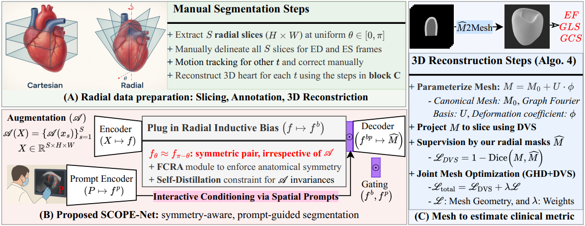
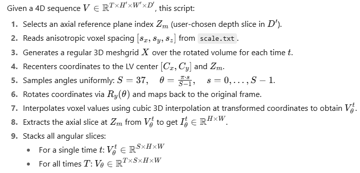
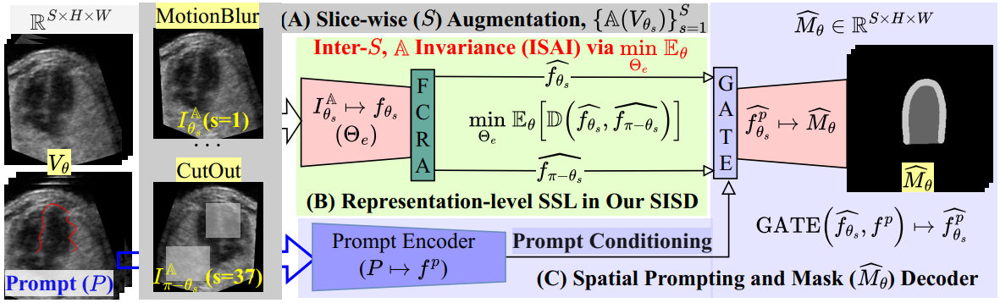
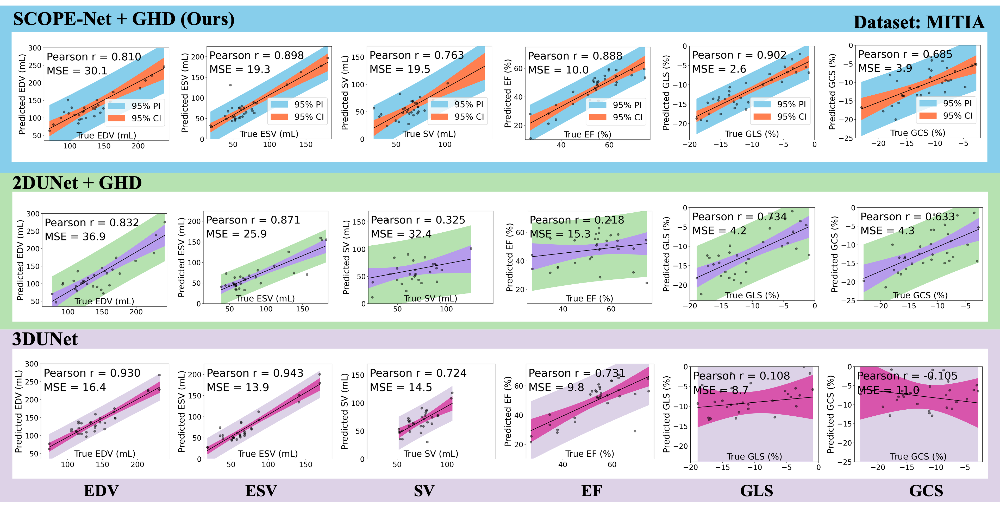

🚧 **Under Development**  ⚠

## 🫀Official Repository for  
## 4D Reconstruction of Fetal Left Ventricle from Echocardiography via 2.5D Radial Segmentation and Graph-Fourier Reconstruction  
## [**FeEcho4D**](https://feecho4d.github.io/Website/): The First Benchmark 4D Fetal Echocardiography Dataset with 4D Left Ventricular Meshes
**Authors:**  
Md. Kamrul Hasan, Qifeng Wang, Haziq Shahard, Lucas Iijima, Nida Ruseckaite, Yihao Luo, Iris Scharnreitner, Andreas Tulzer, Bin Liu, Guang Yang, Choon Hwai Yap  

---

## Overview
This repository provides a complete pipeline for **4D fetal cardiac reconstruction** from echocardiography, using a three-stage framework for left ventricular (LV) analysis:

- **FeEcho4D** – Radial data preparation: extract 2D slices by rotating planes around the LV center (Block A)  
- **SCOPE-Net** – Geometry-aware segmentation: prompt-guided, symmetry-consistent segmentation on radial slices (Block B)  
- **Graph-Fourier Mesh Reconstruction** – High-fidelity 3D reconstruction: generate temporally consistent LV meshes from sparse radial slices using GHD + DVS, enabling clinical metric estimation (Block C)  

<p align="center">
  
</p>

---

## 📦(A) FeEcho4D Dataset Preparation: Radial Slicing to 4D Mesh Reconstruction

A detailed description of dataset preparation is available on our dataset website 👉 [**FeEcho4D**](https://feecho4d.github.io/Website/). This section documents the code used for data preparation. Implementation details and visualizations (overlay images & GIFs) are provided in the folder: **`(1)Volume-to-Slice`**


#### Radial Slicing

<p align="center">
  
</p>


#### Uniform Mask Processing
This step refines raw binary masks into anatomically consistent shapes:
1.	Largest component extraction
2.	Skeletonization + tail extrapolation
3.	Dilation by estimated half-thickness
4.	Optional smoothing via binary opening


---

## 🌀 (B) SCOPE-Net: Symmetry-Consistent Prompt-Enhanced Network
SCOPE-Net is a geometry-adaptive network that explicitly encodes angular symmetry as an inductive prior, unlike fully data-driven deep networks, and integrates spatial prompts through gated modulation of encoder features. 

<p align="center">
  
</p>

### 🧭 SCOPE-Net Features
- **Flip-Consistent Radial Attention (FCRA)** – models angular symmetry in radial views  
- **Geometry-Aware Self-Supervision** – enforces representation-level consistency via an **Inter-Slice Augmentation Invariance (ISAI)** objective; enables label-free self-distillation and improves feature robustness under strong augmentations  
- **Prompt Conditioning** – supports bounding box or scribble inputs  
- **Efficient 2.5D Training** – 56G FLOPs per frame (vs. 79G for 3D networks)
 
**Implementation** – see **`(2)DL_Segmentation`** folder for full code details  

---

## 🕸 (C) GHD-based 3D Mesh Reconstruction

Given a sequence of 3D segmentation volumes, the pipeline reconstructs a continuous left-ventricle (LV) mesh by Graph Harmonic Deformation (GHD):

1. **Initialize** a canonical template mesh `M_0` (e.g., sphere or averaged LV shape)  
2. **Embed** vertices `{v_i}` into a graph structure with Laplacian basis functions  
3. **Load** voxel-wise segmentation masks (binary myocardium/ventricle) and anisotropic voxel spacing  
4. **Voxelize & Sample** – extract point clouds from the mask boundary at each time `t`  
5. **Fit** – deform `M_0` to match sampled boundary points using a GHD energy function:  
   - **Data term** – enforces point-to-surface alignment  
   - **Regularizers** – maintain mesh smoothness and shape consistency  
6. **Optimize** deformation coefficients in harmonic space (low-dimensional basis) for efficiency  
7. **Iterate** over all time frames to produce a smooth temporal mesh sequence `{M_t}`  
8. **Export** reconstructed meshes as `.obj` files under each case directory  

**Step 1: Quickstart via Jupyter Notebook**
```bash
# Step into the (3)Slice-to-Mesh folder
cd /path/to/(3)Slice-to-Mesh

# Launch the notebook for interactive fitting
jupyter notebook ghd_fit_quickstart.ipynb
```
**Step 2: Advanced Execution via Python Script**
```bash
# Explore ghd_fit.py for full parameter control and customization
python ghd_fit.py \
    --data_root data_example \
    --cases FeEcho4D_017 \
    --times time001-010 \
    --device cuda:0 \
    --mesh_out meshes_out \
    --myo_idx 2
```
More details can be found in the [GHDHeart](https://github.com/Luo-Yihao/GHDHeart) project.


---

### 📊 Results: Utility of 3D Reconstruction via Radial Slicing Vs. Standards 2D Vs. Volumetric segmentation
Comparison of SAX, LAX, and Radial slicing (followed by GHD fit) vs. direct 3D volumetric segmentation. Metrics are averaged across LV endocardium (ENDO) and epicardium (EPI). Radial view segmentation consistently outperforms alternatives (*p* < 0.05 for most cases).

| Method | View | HD95 ENDO ↓ | HD95 EPI ↓ | DSC ↑ | MASD ↓ | Avg. 2D DSC ↑ |
|--------|------|-------------|------------|-------|--------|---------------|
| **UNet** | 3D Volume | 6.99 ± 7.41 | 5.87 ± 4.65 | 0.875 ± 0.047 | 2.30 ± 0.82 | 0.756 ± 0.286 |
|         | SAX        | 8.95 ± 6.03 | 5.56 ± 3.11 | 0.837 ± 0.062 | 2.15 ± 0.79 | 0.738 ± 0.267 |
|         | LAX        | 12.68 ± 10.39 | 6.51 ± 4.65 | 0.848 ± 0.057 | 2.72 ± 1.18 | 0.686 ± 0.287 |
|         | **Radial** | **5.57 ± 6.17** | **4.20 ± 4.58** | **0.908 ± 0.034** | **2.08 ± 0.99** | **0.908 ± 0.041** |
| **SAM** | 3D Volume | 6.07 ± 3.05 | 4.93 ± 2.35 | 0.874 ± 0.046 | 2.24 ± 0.73 | 0.759 ± 0.284 |
|         | SAX        | 5.98 ± 4.07 | 2.73 ± 1.05 | 0.874 ± 0.043 | 1.54 ± 0.49 | 0.791 ± 0.230 |
|         | LAX        | 7.93 ± 4.44 | 3.42 ± 1.78 | 0.876 ± 0.039 | 2.02 ± 0.62 | 0.710 ± 0.270 |
|         | **Radial** | **4.63 ± 3.44** | **3.00 ± 2.47** | **0.917 ± 0.033** | **1.82 ± 0.67** | **0.917 ± 0.038** |
> ✅ FLOPs/Frame: **79G** for 3D, **51G** for 2D.


- **Improved 2D segmentation accuracy** – Radial slicing significantly increases the mean DSC across all image slices compared to SAX and LAX, due to the standardized U-shaped myocardial appearance in all slices.  
- **Superior 3D reconstruction quality** – Radial views outperform SAX, LAX, and volumetric segmentation for both networks, with statistically significant differences (*p* < 0.05, t-test) in most comparisons.  
- **Anatomical fidelity & robustness** – Higher reconstruction accuracy is attributed to better 2D segmentations and the shape constraints inherent in radial slicing.  
- **Efficiency gains** – 3D reconstruction from sparse 2D radial slices requires fewer FLOPs per frame than direct 3D volumetric segmentation, improving computational efficiency.


Comparison of SAM, UNet, and **SCOPE-Net** on our **FeEcho4D** dataset and the public **MITEA** dataset. SCOPE-Net consistently outperforms baselines in both fetal and adult datasets (*p* < 0.05 for most metrics).

| Dataset | Method | HD95 MYO ↓ | HD95 ENDO ↓ | HD95 EPI ↓ | DSC ↑ | MASD ↓ | PIA (%) ↓ |
|---------|--------|------------|-------------|------------|-------|--------|-----------|
| **FeEcho4D** | SAM | 8.08 ± 3.06 | 6.06 ± 2.97 | 5.24 ± 2.97 | 0.881 ± 0.040 | 4.71 ± 1.92 | 0.0258 ± 0.2171 |
|           | UNet | 13.09 ± 10.26 | 10.08 ± 9.33 | 9.31 ± 9.36 | 0.838 ± 0.140 | 6.01 ± 3.20 | 1.39 ± 4.61 |
|           | **SCOPE-Net** | **7.46 ± 3.31** | **5.40 ± 3.13** | **4.83 ± 3.14** | **0.893 ± 0.044** | **4.29 ± 1.71** | **0.0036 ± 0.0917** |
| **MITEA** | SAM | 6.49 ± 2.20 | 4.63 ± 3.44 | 3.00 ± 2.47 | 0.917 ± 0.033 | 1.82 ± 0.67 | 0.0499 ± 0.0602 |
|           | UNet | 7.30 ± 3.55 | 5.57 ± 6.17 | 4.20 ± 4.58 | 0.908 ± 0.034 | 2.08 ± 0.99 | 0.7486 ± 2.35 |
|           | **SCOPE-Net** | **5.92 ± 2.37** | **3.96 ± 2.48** | **2.48 ± 1.95** | **0.921 ± 0.033** | **1.54 ± 0.37** | **4.5e-4 ± 1.6e-2** |
> ✅ **FLOPs/Frame**: 63 G for SAM, 51 G for 2D UNet, 56 G for SCOPE-Net.

- **Consistent superiority** – SCOPE-Net significantly outperforms UNet and SAM on FeEcho4D and MITEA across all subregions and metrics (HD95, MASD, DSC, PIA), with *p* < 0.05 in most cases.  
- **Boundary & overlap gains** – Produces sharper, anatomically faithful segmentations, particularly in challenging regions (LV apex, lateral wall) due to radial-aware symmetry modeling.  
- **Ablation findings** –  
  - **FCRA**: Reduces false positives, enforces single-connected myocardial contours.  
  - **ISAI-driven SISD**: Improves cross-angular view consistency, enhancing PIA.  
  - **Prompt-guided modulation**: Steers segmentation toward clinically plausible shapes, improving downstream 3D reconstruction via GHD.  
- **Generalization** – Structured integration of anatomical priors improves robustness under motion artifacts and acoustic dropout.  
  

**🔍 Experiment:** We compare point clouds between predicted and ground-truth meshes in both short-axis views and 3D perspectives on FeEcho4D and MITEA, using SCOPE-Net vs. UNet.
**✅ Summary:** SCOPE-Net shows superior spatial alignment, especially at the apex and lateral wall, indicating better segmentation consistency and reconstruction quality.

<p align="center">
  
</p>

**🔍 Experiment:** On the MITEA dataset, we evaluate clinical metrics (EF, GLS) predicted by SCOPE-Net+GHD, UNet+GHD, and 3D UNet, reporting Pearson r, MSE, and 95% confidence intervals.
**✅ Summary:** Our method achieves the highest accuracy and lowest variance, demonstrating strong potential for reliable clinical use in fetal cardiac analysis.

---
## Citation

If you find this work helpful, please cite:

```bibtex
@article{hasan2025feecho4d,
  title={4D Reconstruction of Fetal Left Ventricle from Echocardiography via 2.5D Radial Segmentation and Graph-Fourier Reconstruction},
  author={XXX},
  journal={XXX},
  volume={XXX},
  pages={XXX},
  year={2025},
  doi={XXX}
}
```
---
## 🙏 Acknowledgements

- 👏 We thank all co-authors for their contributions to this work, particularly in model development, dataset construction, and clinical validation. 
- 👏 Special thanks to Kepler University Hospital for their support in data acquisition and expert annotations.
- 👏 And to Imperial College London and Dalian University of Technology for providing research infrastructure and technical guidance.
-  [[Wecome to Dataset Website]](https://feecho4d.github.io/Website/) [[Wecome to Qifeng's Github]](https://github.com/QifengWang0702) [[Wecome to Haziq's Github]](https://github.com/haziqshahard) [[Wecome to Yihao's Github]](https://github.com/Luo-Yihao)
