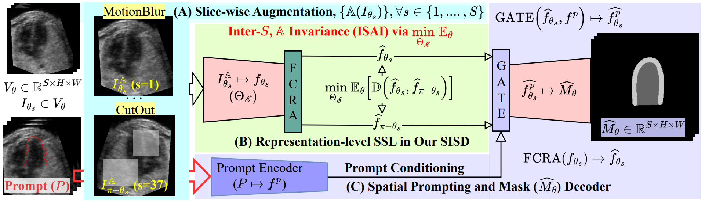

🚧 **Under Development**  ⚠

## 🫀Official Repository for  
## 4D Reconstruction of Fetal Left Ventricle from Echocardiography via 2.5D Radial Segmentation and Graph-Fourier Reconstruction  
## FeEcho4D: The First Benchmark 4D Fetal Echocardiography Dataset with 4D Left Ventricular Meshes
**Authors:**  
Md. Kamrul Hasan, Qifeng Wang, Haziq Shahard, Lucas Iijima, Nida Ruseckaite, Yihao Luo, Iris Scharnreitner, Andreas Tulzer, Bin Liu, Guang Yang, Choon Hwai Yap  

---

## Overview
This repository provides a complete pipeline for **4D fetal cardiac reconstruction** from echocardiography, using a three-stage framework for left ventricular (LV) analysis:

- **FeEcho4D** – Radial data preparation: extract 2D slices by rotating planes around the LV center (Block A)  
- **SCOPE-Net** – Geometry-aware segmentation: prompt-guided, symmetry-consistent segmentation on radial slices (Block B)  
- **Graph-Fourier Mesh Reconstruction** – High-fidelity 3D reconstruction: generate temporally consistent LV meshes from sparse radial slices using GHD + DVS, enabling clinical metric estimation (Block C)  

<p align="center">
  
</p>

---

## 📦(A) FeEcho4D Dataset Preparation: Radial Slicing to 4D Mesh Reconstruction

A detailed description of dataset preparation is available on our dataset website 👉 [**FeEcho4D**](https://feecho4d.github.io/Website/). This section documents the code used for data preparation. Implementation details and visualizations (overlay images & GIFs) are provided in folder: **`(1) Volume-to-Slice`**


#### Radial Slicing

<p align="center">
  
</p>


#### Uniform Mask Processing
This step refines raw binary masks into anatomically consistent shapes:
1.	Largest component extraction
2.	Skeletonization + tail extrapolation
3.	Dilation by estimated half-thickness
4.	Optional smoothing via binary opening


---

## (B) SCOPE-Net: Symmetry-Aware Prompt-Guided Segmentation

**SCOPE-Net is designed specifically for radial fetal ultrasound. It integrates:**
-	Flip-Consistent Radial Attention (FCRA) for angular symmetry modeling.
-	Inter-Slice Augmentation Invariance (ISAI) for self-supervised consistency.
-	Prompt Conditioning using bounding box or scribble inputs.
-	Efficient 2.5D training with 56G FLOPs per frame (vs. 79G for 3D UNet).

**Architecture Highlights:**
-	U-Net backbone with symmetry-aware modules.
-	Optional spatial prompts injected via gating.
-	Robust to radial view variations and signal dropout.

<p align="center">
  
</p>

---

## (C) GHD-based 3D Mesh Reconstruction

Given a sequence of 3D segmentation volumes, the pipeline reconstructs a continuous left-ventricle (LV) mesh by Graph Harmonic Deformation (GHD):

1.	Initialize a canonical template mesh `M_0` (e.g., a sphere or averaged LV shape).
2.	Embed vertices `{v_i}` into a graph structure with Laplacian basis functions.
3.	Load voxel-wise segmentation masks (binary myocardium/ventricle) and anisotropic voxel spacing.
4.	Voxelize & Sample: obtain point clouds from the mask boundary at each time `t`.
5.	Fit: deform the template mesh `M_0` to match sampled boundary points using a GHD energy function combining a data term and Laplacian regularizers.
-   Data term: enforces point-to-surface alignment
-   Regularizers: maintain mesh smoothness and shape consistency
6.	Optimize coefficients in harmonic space (low-dimensional basis) for efficient deformation.
7.	Iterate over all time frames to produce smooth temporal mesh sequence `{M_t}`.
8.	Output reconstructed meshes in `.obj` format under each case directory.

Step 1: Quickstart via Jupyter Notebook
```bash
# Step into the (3)Slice-to-Mesh folder
cd /path/to/(3)Slice-to-Mesh

# Launch the notebook for interactive fitting
jupyter notebook ghd_fit_quickstart.ipynb
```
Step 2: Advanced Execution via Python Script
```bash
# Explore ghd_fit.py for full parameter control and customization
python ghd_fit.py \
    --data_root data_example \
    --cases FeEcho4D_017 \
    --times time001-010 \
    --device cuda:0 \
    --mesh_out meshes_out \
    --myo_idx 2
```
More details can be found in the [GHDHeart](https://github.com/Luo-Yihao/GHDHeart) project.

---

## FeEcho4D Dataset

**FeEcho4D is the first public dataset for 4D radial fetal echocardiography.**
-	 52 subjects, 1.8k annotated 3D volumes, 68k annotated 2D slices
-	 37 radial views per volume, full 4D coverage
-	 Manual annotation across the full cardiac cycle, including both ED and ES frames
-  Clinical metrics: EF, GLS, GCS, EDV, ESV, SV

** Access the dataset and tools:**
👉 [**FeEcho4D**](https://feecho4d.github.io/Website/)

---

## Clinical Evaluation & Results

<p align="center">
  
</p>

**🔍 Experiment:** We compare point clouds between predicted and ground-truth meshes in both short-axis views and 3D perspectives on FeEcho4D and MITEA, using SCOPE-Net vs. UNet.
**✅ Summary:** SCOPE-Net shows superior spatial alignment, especially at the apex and lateral wall, indicating better segmentation consistency and reconstruction quality.

<p align="center">
  
</p>

**🔍 Experiment:** On the MITEA dataset, we evaluate clinical metrics (EF, GLS) predicted by SCOPE-Net+GHD, UNet+GHD, and 3D UNet, reporting Pearson r, MSE, and 95% confidence intervals.
**✅ Summary:** Our method achieves the highest accuracy and lowest variance, demonstrating strong potential for reliable clinical use in fetal cardiac analysis.

---
## Citation

If you find this work helpful, please cite:

```bibtex
@article{hasan2025feecho4d,
  title={4D Reconstruction of Fetal Left Ventricle from Echocardiography via 2.5D Radial Segmentation and Graph-Fourier Reconstruction},
  author={XXX},
  journal={XXX},
  volume={XXX},
  pages={XXX},
  year={2025},
  doi={XXX}
}
```
---
## 🙏 Acknowledgements

- 👏We thank all co-authors for their contributions to this work, particularly in model development, dataset construction, and clinical validation. 
- 👏 Special thanks to Kepler University Hospital for their support in data acquisition and expert annotations.
- 👏And to Imperial College London and Dalian University of Technology for providing research infrastructure and technical guidance.
-  [[Wecome to Qifeng's Github]](https://github.com/QifengWang0702) [[Wecome to Haziq's Github]](https://github.com/haziqshahard) [[Wecome to Yihao's Github]](https://github.com/Luo-Yihao)
