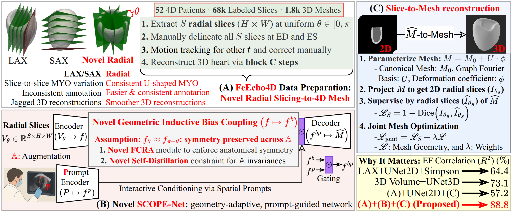

# 🫀 FeEcho4D: 4D Reconstruction of Fetal Left Ventricle from Echocardiography

**Official repository for:**  
**4D Reconstruction of Fetal Left Ventricle from Echocardiography via 2.5D Radial Segmentation and Graph-Fourier Reconstruction**  
Md. Kamrul Hasan†, Qifeng Wang†, Haziq Shahard, Lucas Iijima, Nida Ruseckaite, Iris Scharnreitner, Andreas Tulzer, Bin Liu‡, Guang Yang‡, Choon Hwai Yap‡  

---

## 📌 Overview

This repository provides a complete pipeline for **4D fetal cardiac reconstruction** from echocardiography. Our pipeline introduces:

- **FeEcho4D**: The first benchmark dataset for radial fetal echocardiography.
- **SCOPE-Net**: A novel geometry-aware segmentation network.
- **Graph-Fourier Mesh Reconstruction**: High-fidelity reconstruction from sparse radial slices.
- **Clinical Evaluation**: Ejection Fraction (EF), Global Longitudinal/Circumferential Strain (GLS/GCS).

---

## 🧭 Pipeline Overview
We propose a three-stage framework for 4D fetal LV analysis:
-	**(A)**	Radial Data Preparation: Extract 2D slices by rotating planes around the LV center.
-	**(B)**	SCOPE-Net Segmentation: Perform prompt-guided, symmetry-aware segmentation on radial slices.
-	**(C)**	3D Mesh Reconstruction: Reconstruct temporally consistent 3D LV meshes using GHD + DVS, enabling clinical metric estimation.
<p align="center">
  
</p>

---

## 🧠 SCOPE-Net: Symmetry-Aware Prompt-Guided Segmentation

**SCOPE-Net is designed specifically for radial fetal ultrasound. It integrates:**
-	Flip-Consistent Radial Attention (FCRA) for angular symmetry modeling.
-	Inter-Slice Augmentation Invariance (ISAI) for self-supervised consistency.
-	Prompt Conditioning using bounding box or scribble inputs.
-	Efficient 2.5D training with 56G FLOPs per frame (vs. 79G for 3D UNet).

**Architecture Highlights:**
-	U-Net backbone with symmetry-aware modules.
-	Optional spatial prompts injected via gating.
-	Robust to radial view variations and signal dropout.

<p align="center">
  
</p>

---

## 📂 FeEcho4D Dataset

**FeEcho4D is the first public dataset for 4D radial fetal echocardiography.**
-	🧪 52 subjects, 1,845 annotated 3D volumes, 3M+ annotated 2D slices
-	🌀 37 radial views per volume, full 4D coverage
-	🎯 Manual annotation across the full cardiac cycle, including both ED and ES frames
- ✅ Clinical metrics: EF, GLS, GCS, EDV, ESV, SV

**📎 Access the dataset and tools:**
👉 [**FeEcho4D**](https://feecho4d.github.io/Website/)

---

## 🚀 Getting Started

1. Install Dependencies
```bash
git clone https://github.com/kamruleee51/FeEcho4D.git
cd FeEcho4D
pip install -r requirements.txt
```
2. Part(A) Radial Data Preparation
```bash
xxx
```
3.Part(B) SCOPE-Net Segmentation
```bash
xxx
```
4.Part(C) 3D Mesh Reconstruction

To perform parametric 3D mesh fitting using GHD on fetal cardiac masks, follow the two-step process:

Step 1: Quickstart via Jupyter Notebook
```bash
# Step into the Part(C)GHD folder (if not already there)
cd /path/to/Part(C)GHD

# Launch the notebook for interactive fitting
jupyter notebook ghd_fit_quickstart.ipynb
```
Step 2: Advanced Execution via Python Script
```bash
# Explore ghd_fit.py for full parameter control and customization
python ghd_fit.py \
    --data_root data_example \
    --cases FeEcho4D_017 \
    --times time001-time010 \
    --device cuda:0 \
    --mesh_out meshes_out \
    --myo_idx 2
```

---

## ⚕️ Clinical Evaluation & Results

<p align="center">
  
</p>

**🔍 Experiment:** We compare point clouds between predicted and ground-truth meshes in both short-axis views and 3D perspectives on FeEcho4D and MITEA, using SCOPE-Net vs. UNet.
**✅ Summary:** SCOPE-Net shows superior spatial alignment, especially at the apex and lateral wall, indicating better segmentation consistency and reconstruction quality.

<p align="center">
  
</p>

**🔍 Experiment:** On the MITEA dataset, we evaluate clinical metrics (EF, GLS) predicted by SCOPE-Net+GHD, UNet+GHD, and 3D UNet, reporting Pearson r, MSE, and 95% confidence intervals.
**✅ Summary:** Our method achieves the highest accuracy and lowest variance, demonstrating strong potential for reliable clinical use in fetal cardiac analysis.

---
## 📈 Citation

If you find this work helpful, please cite:

```bibtex
@article{hasan2025feecho4d,
  title={4D Reconstruction of Fetal Left Ventricle from Echocardiography via 2.5D Radial Segmentation and Graph-Fourier Reconstruction},
  author={XXX},
  journal={XXX},
  volume={XXX},
  pages={XXX},
  year={2025},
  doi={XXX}
}
```
---
## 🙏 Acknowledgements

- 👏We thank all co-authors for their contributions to this work, particularly in model development, dataset construction, and clinical validation. 
- 👏 Special thanks to Kepler University Hospital for their support in data acquisition and expert annotations.
- 👏And to Imperial College London and Dalian University of Technology for providing research infrastructure and technical guidance.
-  [[Wecome to Qifeng's Github]](https://github.com/QifengWang0702) [[Wecome to Haziq's Github]](https://github.com/haziqshahard) [[Wecome to Yihao's Github]](https://github.com/Luo-Yihao)
